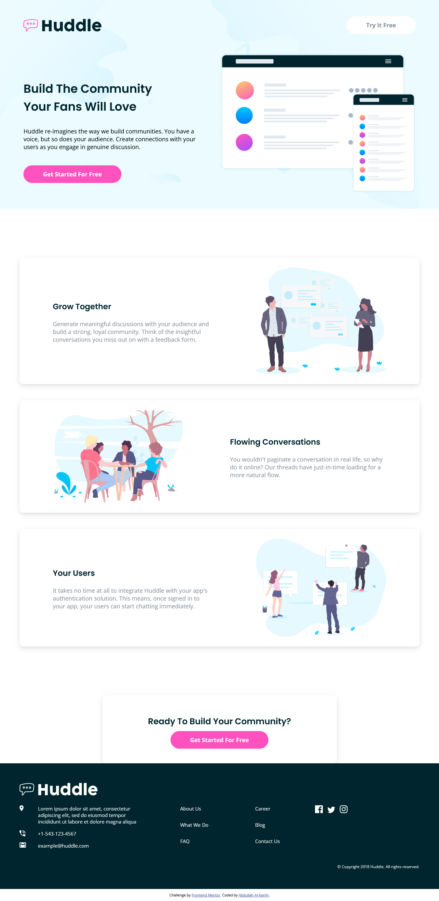
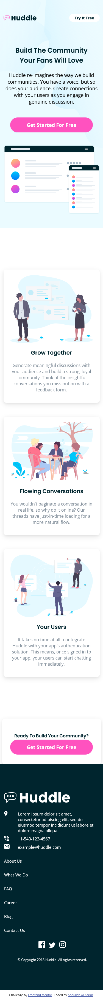

# Frontend Mentor - Huddle landing page with alternating feature blocks solution

This is a solution to the [Huddle landing page with alternating feature blocks challenge on Frontend Mentor](https://www.frontendmentor.io/challenges/huddle-landing-page-with-alternating-feature-blocks-5ca5f5981e82137ec91a5100). Frontend Mentor challenges help you improve your coding skills by building realistic projects.

## Overview

### The challenge

Users should be able to:

- View the optimal layout for the site depending on their device's screen size
- See hover states for all interactive elements on the page

### Screenshot

- Desktop Screenshot

- Mobile Screenshot

## My process

### Built with

- Semantic HTML5 markup
- CSS custom properties
- CSS grid
- Responsive design

### What I learned
CSS grid and responsive design

## Author

- Frontend Mentor - [@alkarim99](https://www.frontendmentor.io/profile/alkarim99)
- Twitter - [@a_alkarim_a](https://www.twitter.com/a_alkarim_a)
